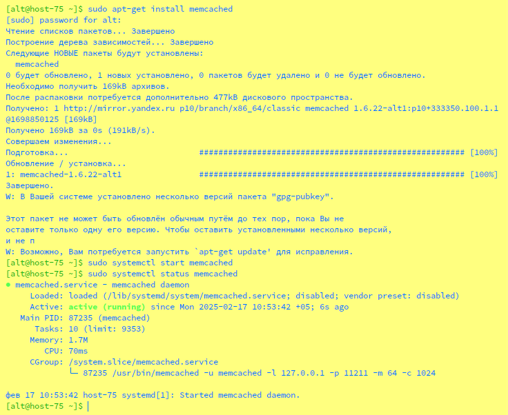
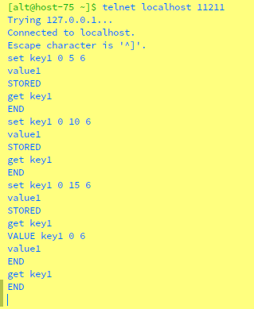
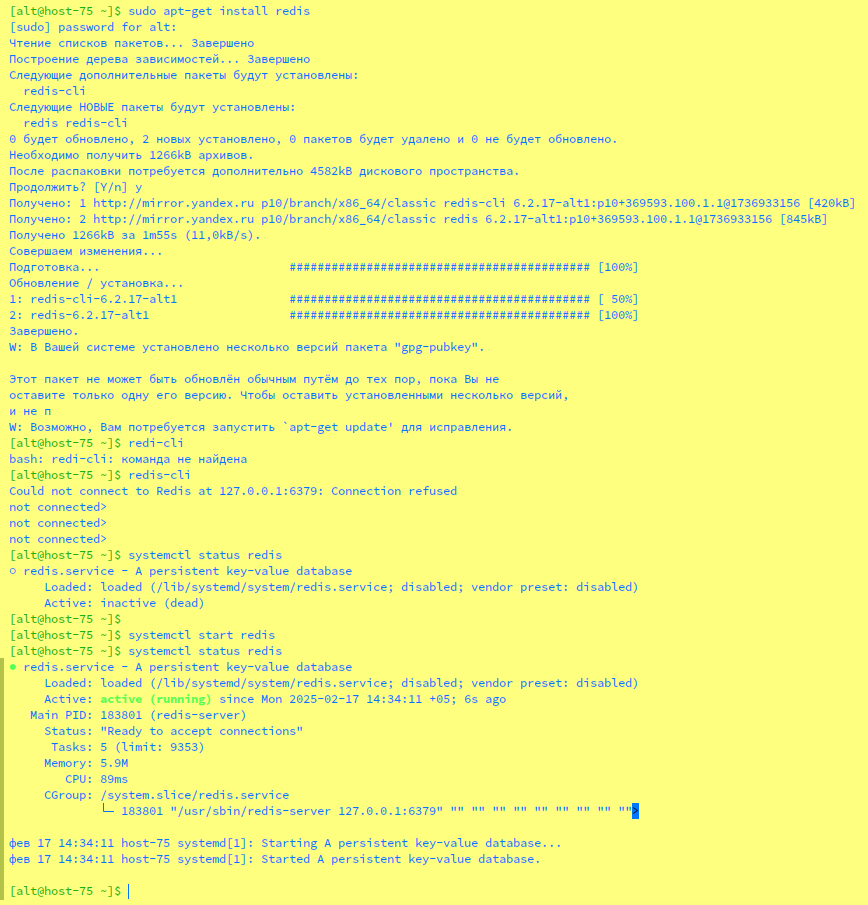
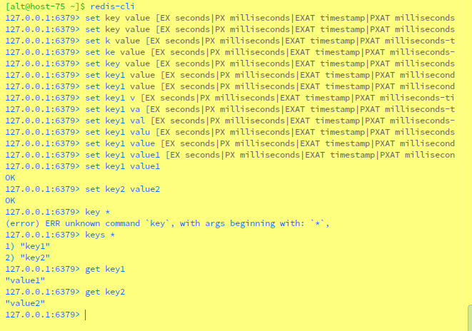
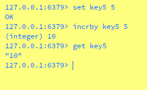

# Домашнее задание к занятию "`Кеширование Redis/memcached`" - `Горелов Николай`


### Задание 1. Кеширование 

Приведите примеры проблем, которые может решить кеширование. 

*Приведите ответ в свободной форме.*

---

### Решение 1. Кеширование

**Примеры проблем, которые может решить кеширование:**

1. **Ускорение доступа к данным:** Кеширование позволяет хранить часто запрашиваемые данные в быстродоступной памяти, что уменьшает время доступа к ним. Например, кеширование результатов запросов к базе данных или API.

2. **Снижение нагрузки на сервер:** Кеширование уменьшает количество запросов к основным источникам данных (например, базам данных), что снижает нагрузку на сервер и позволяет ему обрабатывать больше запросов.

3. **Улучшение производительности приложений:** Кеширование статических ресурсов (например, изображений, CSS, JavaScript) на стороне клиента или промежуточных серверов (CDN) ускоряет загрузку веб-страниц.

4. **Снижение задержек (latency):** Кеширование данных на географически близких серверах (например, в CDN) уменьшает задержки для пользователей, находящихся далеко от основного сервера.

5. **Экономия ресурсов:** Кеширование позволяет избежать повторного выполнения ресурсоемких операций, таких как сложные вычисления или запросы к внешним API.

---

### Задание 2. Memcached

Установите и запустите memcached.

*Приведите скриншот systemctl status memcached, где будет видно, что memcached запущен.*

---

### Решение 2. Memcached

1. Установим Memcached:
   ```bash
   sudo apt-get update
   sudo apt-get install memcached
   ```

2. Запустим Memcached:
   ```bash
   sudo systemctl start memcached
   ```

3. Проверим статус Memcached:
   ```bash
   sudo systemctl status memcached
   ```

  

---

### Задание 3. Удаление по TTL в Memcached

Запишите в memcached несколько ключей с любыми именами и значениями, для которых выставлен TTL 5. 

*Приведите скриншот, на котором видно, что спустя 5 секунд ключи удалились из базы.*

---

### Решение 3. Удаление по TTL в Memcached

1. Подключаемся к Memcached с помощью `telnet`:
   ```bash
   telnet localhost 11211
   ```

2. Записываем несколько ключей с TTL 5 секунд:
   ```bash
   set key1 0 5 6
   value1
   ```

3. Ждём 5 секунд и проверяем наличие ключей:
   ```bash
   get key1
   ```

  

---

### Задание 4. Запись данных в Redis

Запишите в Redis несколько ключей с любыми именами и значениями. 

*Через redis-cli достаньте все записанные ключи и значения из базы, приведите скриншот этой операции.*

---

### Решение 4. Запись данных в Redis

1. Установим Redis:
   ```bash
   sudo apt-get install redis
   ```

2. Запишем несколько ключей в Redis:
   ```bash
   redis-cli
   set key1 value1
   set key2 value2
   ```

3. Получим все ключи и их значения:
   ```bash
   keys *
   get key1
   get key2
   ```




---

## Дополнительные задания (со звёздочкой*)
Эти задания дополнительные, то есть не обязательные к выполнению, и никак не повлияют на получение вами зачёта по этому домашнему заданию. Вы можете их выполнить, если хотите глубже разобраться в материале.

### Задание 5*. Работа с числами 

Запишите в Redis ключ key5 со значением типа "int" равным числу 5. Увеличьте его на 5, чтобы в итоге в значении лежало число 10.  

*Приведите скриншот, где будут проделаны все операции и будет видно, что значение key5 стало равно 10.*

---

### Решение 5*. Работа с числами

1. Запиcываем ключ `key5` со значением 5:
   ```bash
   redis-cli
   set key5 5
   ```

2. Увеличем значение ключа `key5` на 5:
   ```bash
   incrby key5 5
   ```

3. Проверяем значение ключа `key5`:
   ```bash
   get key5
   ```

  

---